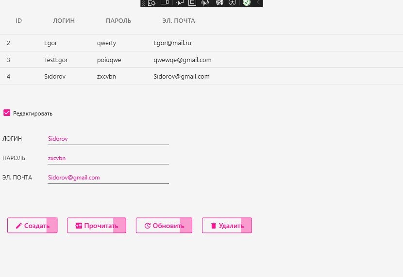

<h1>Задание 5. Использование EntityFrameworkCore и SQLite</h1>

<h2>Описание проекта</h2>

WPF-приложение для управления пользователями с использованием:

<ul>
    <li>Entity Framework Core</li>
    <li>SQLite</li>
</ul>

<h2>Основные функции</h2>
<ul>
    <li>Аутентификация пользователей</li>
    <li>Управление учетными записями</li>
</ul>

<h2>Инструкция по запуску</h2>
<ul>
    <li>Запустите файл Task5SQLite.exe</li>
</ul>

<h2>Интерфейс приложения</h2>
<table border="1" cellpadding="5">
    <tr>
        <td></td>
        <td></td>
    </tr>
    <tr>
        <td align="center">Форма входа в систему</td>
        <td align="center">Редактирование пользователей</td>
    </tr>
</table>
